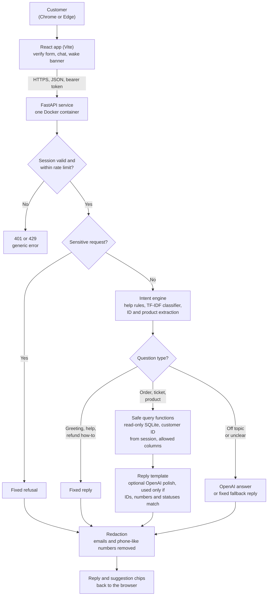

# Customer Query System

A privacy-first support assistant for orders, returns, warranty and tickets.

**Live app:** https://customer-query-system-xpzh.onrender.com
**Code:** https://github.com/vermaaditi23/Customer-query-system
**PDF version of this README:** [docs/README.pdf](docs/README.pdf)

> **A quick heads-up: the first load can take up to a minute.** The app runs on Render's free tier, which puts the service to sleep when nobody is using it. If you are the first visitor in a while, a "Waking up the assistant" banner appears while the server starts. Please wait for it, and refresh once if the page stays blank. After that, it is fast.
>
> For the smoothest experience, use **Chrome** or **Edge**.

## Give it a try

1. Open the live link and expand the **How to test** panel.
2. Verify with a sample customer ID and one of that customer's order IDs, both shown in the panel.
3. Ask:
   - "Where is my order?"
   - "What is the tracking number?"
   - "Can I cancel it?"
   - "Is the Bluetooth Speaker returnable, and what is the warranty?"
   - "Show my recent orders"
   - "What is the status of my ticket?"
   - "How do I get a refund?"
4. Then try to break it: "Give me the phone number of customer 5." It politely says no, by design.

## Architecture



**Reading the diagram.** Privacy checks come first. The customer ID is taken only from the server-side session, never from the chat text, and every reply passes through redaction on its way out. OpenAI is optional and sits beside the data path, so the app works fully without an API key.

## How it works

- **Backend:** FastAPI with SQLite, rebuilt from the CSV files in `data/csv` every time the app starts.
- **Frontend:** a React (Vite) app served by the same FastAPI server, so there is one link and one port.
- **Packaging:** one Docker image builds the React site, then packages it with the Python backend, so Render deploys both parts as a single service.
- **Understanding questions:** privacy rules check each message first. A small TF-IDF classifier written in pure Python (about 90% accurate on held-out phrases) then works out what the customer wants. Order and ticket IDs are picked out of the message, and product names are matched even with typos.
- **Follow-ups:** very short messages such as "how?" reuse the previous topic in the same session.
- **OpenAI (optional):** it answers off-topic questions and can make replies sound friendlier. A polished reply is used only if every ID, number, status and yes/no meaning is unchanged. Otherwise the original reply is sent.

## How your data stays safe

- Customers verify with their customer ID plus one of their own order IDs.
- Every lookup is limited to the verified customer, reads only approved columns, and uses a read-only database connection.
- Names (apart from a first-name greeting), emails, phone numbers, addresses, cities, states and pincodes are never returned.
- Someone else's order looks exactly like an order that does not exist, so IDs cannot be probed.
- Five failed attempts trigger a five-minute lockout. Requests are rate-limited, and sessions expire after 20 minutes idle.
- Replies are scanned for email-like and phone-like text before sending, and logs never contain what a customer typed.
- Sensitive requests are refused by code before OpenAI is ever called. When OpenAI is enabled, replies that contain account details may be sent to it for rewriting. These can include order and ticket IDs, statuses, dates, amounts, tracking numbers and product names. Names, emails, phone numbers and addresses are never part of a reply, so they are never sent.

## Run it yourself

```bash
# With Docker
docker build -t customer-query-system .
docker run -p 7860:7860 customer-query-system

# Or just the backend (Python 3.10+)
cd backend
pip install -r requirements.txt
uvicorn app.main:app --port 8000

# Tests
python -m pytest -q
```

To use the optional OpenAI layer, set the `OPENAI_API_KEY` environment variable. Never commit the key.

## Things to know about the dataset

- The files contain **20 products and 569 order items**, not the 40 and 700+ that the dataset's own README mentions.
- Order status and payment status do not depend on each other, so some delivered orders show a pending payment. The assistant says so plainly instead of hiding it.
- Many orders have no tracking number yet. The assistant explains that tracking appears once the order ships.

## Known limitations

- Verifying with guessable IDs is a demonstration. A real system would use a one-time code (OTP).
- The assistant is read-only. It tells you whether an order can be cancelled or returned, but it does not do it for you.
- Sessions and follow-up memory reset whenever the free host restarts or sleeps.
- Voice input and output is not built yet. It is planned for later.
